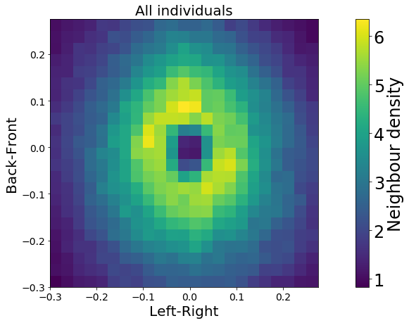

*******************
idtracker.ai output
*******************

Output structure
================

Idtracker.ai will generate a ``session_[SESSION_NAME]`` folder in the same directory as the input videos (or in the ``--output_dir`` path if specified, see :ref:`advanced parameters<output>`). It may be have the structure below:

.. admonition:: Note
    :class: sidebar note
    
    The content of the session folder may change depending on the necessities of each session. Also, ``--data_policy`` can remove some of the data after finishing a successful tracking (see :ref:`advanced parameters<output>`).

.. code-block:: 
    :caption: idtracker.ai session's output structure
    :emphasize-lines: 14, 15

    session_[SESSION_NAME]
    ├─ accumulation_*
    │  └─ ...
    ├─ crossings_detector
    │  └─ ...
    ├─ identification_images
    │  └─ id_images_*.hdf5
    ├─ preprocessing
    │  ├─ list_of_blobs.pickle
    │  └─ list_of_fragments.pickle
    ├─ segmentation_data
    │  └─ episode_images_*.hdf5
    ├─ trajectories
    │  ├─ trajectories.npy
    │  └─ trajectories_wo_gaps.npy
    ├─ video_object.json
    └─ idtrackerai.log

Trajectory files
================

The most important files for the end user are the trajectories files located in `trajectories` folder. Once the tracking finished, trajectory files can be loaded by

.. code-block:: python

    import numpy as np

    trajectories_dict = np.load(
        "./session_example/trajectories/trajectories_wo_gaps.npy", allow_pickle=True
    ).item()

.. tip::
    *.npy* files can only be loaded with Numpy (Python). If you want idtracker to automatically convert theses files into *.csv* and *.json* files, set ``CONVERT_TRAJECTORIES_TO_CSV_AND_JSON`` to ``true`` before running idtracker.ai (see :ref:`advanced parameters<output>`).

    If you missed it and the tracking is done, you still can convert those files running the command ``idtrackerai_csv path/to/session_[SESSION_NAME]``. 

The files contain a Python dictionary with the following entries:

- ``trajectories``: a Numpy array with shape (`N_frames`, `N_animals`, 2) with the `xy` coordinate of each identity in every video frame.
- ``version``: the idtracker.ai version which created the current file
- ``video_paths``: the input video paths
- ``frames_per_second``: the input videos frame rate
- ``body_length``: the mean body length computed as the mean value of the diagonal of all individual blob's bounding boxes
- ``stats``: a dictionary containing four different measurements of the session's identification accuracy.
- ``areas`` a dictionary containing the mean, median and standard deviation of the blob area for each individual
- ``setup_points``: a dictionary of the user defined setup points (from validator)
- ``identities_labels``: a list of user defined identity labels (from validator) 
- ``identities_groups``: a list of user defined identity groups (from validator)
- ``id_probabilities``: a Numpy array with shape (`N_frames`, `N_animals`) with the identity assignment probability for each individual in each frame of the video

.. warning:: 
    ``body_length`` is not a reliable measurement of the real animal sizes. Its value depends on the segmentation parameters used and on the video conditions.

When crossings occur, the identification network cannot be applied and the involved individuals cannot be located properly. In these situations, the trajectories have a *gap* full of *NaN* (not a number) values meaning the individual couldn't be located. These trajectories are saved in ``trajectories.npy``.

To close the gaps, an interpolation algorithm takes place and generates an improved trajectory file with almost no gaps ``trajectories_wo_gaps.npy``.

Finally, if the validator is used after the tracking, the ``trajectories_validated.npy`` file will contain the trajectories corrected manually by the user

Video generators
================

Idtracker.ai provides a tool to generate *tracked videos*, i.e. a composition of the original input video with the trajectories and labels on top. The command

.. code-block:: bash
    
    idtrackerai_video path/to/session_folder

generates a general video inside the session folder. Individual videos can be generated by adding the flag ``--individual`` to the command above, also, the original video can be drawn in grayscale adding ``--gray``. The video time interval can be defined using ``--s`` (start) and ``--e`` (end). For example

.. code-block:: bash

    idtrackerai_video path/to/session_folder --individual --gray --s 0 --e 1000

to generate individual videos in grayscale from frame 0 to frame 1000 from the tracked session folder.

Below are two examples: a general video on the left and an individual on the right:

.. raw:: html

    

    <iframe width="250" height="200" src="https://www.youtube.com/embed/U9JPLU5rlq0?loop=1&modestbranding=1&rel=0&playlist=U9JPLU5rlq0" frameborder="0" allowfullscreen></iframe>
    <iframe width="345" height="200" src="https://www.youtube.com/embed/cCOfTAU_3JA?loop=1&modestbranding=1&rel=0&playlist=cCOfTAU_3JA" frameborder="0" allowfullscreen></iframe>
    

By running ``idtrackerai_video -h``, a list of all available options like the one above is printed:

    --individual  Generate individual video. Default is a general video
    --gray         Draw the original video in grayscale
    --t            ``path`` Path to the trajectory file, default is session_dir/trajectories/trajectories_wo_gaps.npy
    --tl           ``int`` Trail length, number of points used to draw the individual trajectories traces
    --s            ``int`` Frame where to start the video
    --e            ``int`` Frame where to end the video

idmatcher.ai
============

Idmatcher.ai is a tool to match identities from two different tracking sessions with the same animals. Currently the tool is not *easy to use*, it is in the repository https://gitlab.com/polavieja_lab/idmatcherai and has to be installed manually (``git clone`` and ``pip install``). We are currently working to incorporate this tool into the idtracker.ai package making it more user friendly.

*trajectorytools* and our jupyter Notebooks
===========================================

We are constantly developing new tools to analyze the trajectories that idtracker.ai outputs. We provide Jupyter Notebooks with examples of analysis routines for groups of animals.

You can install the *trajectorytools* module from the following GitHub repository:
https://github.com/fjhheras/trajectorytools

You can find some analysis routines from [1]_ implemented with the *trajectorytools* module in the Jupyter Lab Notebook *trajectories.ipynb* in the following GitLab repository: https://gitlab.com/polavieja_lab/idtrackerai_notebooks.

Using a 10 juvenile fish video, we get some of the figures below.

.. image:: _static/ipynb/trajectories.png
    :width: 49%

Smoothed trajectories (left) and density of neighbors around a focal fish (right)

.. figure:: _static/ipynb/velocity_and_acceleration.png

    Velocities and accelerations

.. figure:: _static/ipynb/polar_plots.png

    Polar distributions of positions, turnings and accelerations

.. figure:: _static/ipynb/distances_vs_random.png

    Inter-individual distance histograms compared with shuffled trajectories

.. [1] Hinz, R. C., & de Polavieja, G. G. (2017). Ontogeny of collective behavior reveals a simple attraction rule. *Proceedings of the National Academy of Sciences*

===============

Idtracker.ai internal data
==========================

The majority of the generated data is a byproduct of the tracking process and it is not meant to be read or used by the end user. Still, an intuition of the data content can be read as:

- ``accumulation_*`` contains the identification network parameters. It can be used to match identities with other sessions with idmatcher.ai.
- ``crossings_detector`` contains the individual/crossing classification network parameters.
- ``identification_images`` contains the images used for identification. This is, an image for every animal and every frame on the video.
- ``segmentation_data`` contains the temporal image before being processed to become identification images.
- ``video_object.json`` contains basic video properties in human readable *.json* format.