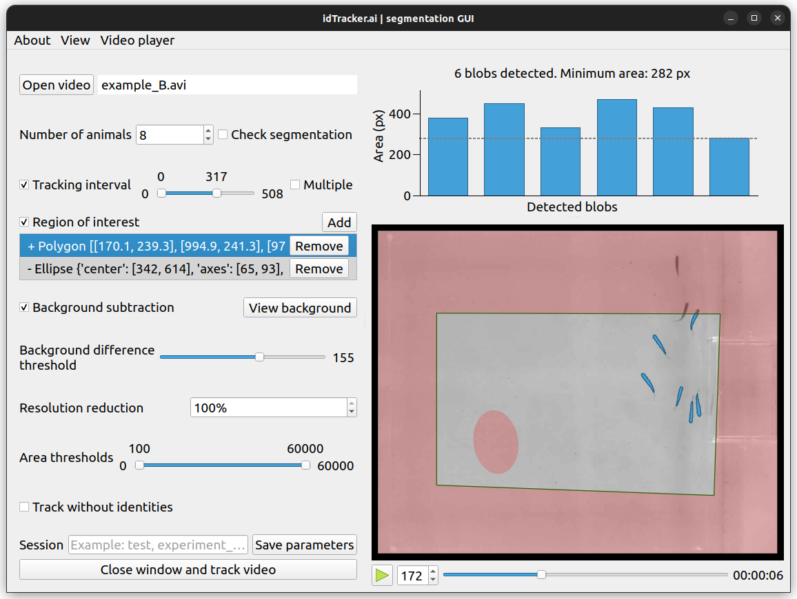

****************
Segmentation app
****************

Idtracker.ai has a graphical application to define the parameters to run the tracking process.

On the left side there are the controls which define the tracking parameters. On the right we can see the effect of the current parameters on the video player and on the upper bar plot.

Tell idtracker.ai how to detect the animals in your video, i.e. how to segment the video. In the video player (on the right), the detected blobs (a general term referring to any detected object on the video) will appear as blue polygons and their area will appear in the upper bar plot.

.. tip::
  Make sure that:

  - All animals appear as blobs when they are in frame
  - Every blob is an animal (no reflection or object are detected as blobs)
  
  Adjust the controls in the app to get an accurate segmentation and idtracker.ai will do the rest.

Controls on the left are arranged in order of use. This is, if you are not sure of what to do, it is recommended to follow the order from top to bottom.

The best way to get used to the app is to use and explore it, every control rises a *tooltip* when the cursor is layed on it. If you have troubles using it, here is a detailed description of every control.

1. Open video
-------------

To start using the app, click in "Open video" button to browse in you folders and load a video. You can select more than one video file to track them sequentially (intended for tracking multiple video clips of the same experiment as if they were merged).

Once done, the video path will appear next to the button. If more than one file were selected, they will appear in order, you can rearrange them by drag and drop. Clicking on the video paths will bring the video player to the first frame of the clip.

2. Number of animals
--------------------

User has to define the number of animals in the video. There can be time intervals where not all animals are visible but, for a good performance of the algorithm, there must be multiple parts in the video where the number of detected blobs is equal to the specified **Number of animals**.

Idtracker.ai is not prepared to deal with noise blobs (blobs not corresponding to an individual nor a crossing). If idtracker.ai segments a frame and it finds more blobs than animals (i.e. certainty of noise blobs presence) idtracker.ai will warn you on the console and, if 'Check segmentation' is checked, it will abort the tracking process to allow user to explore the video again and readjust the segmentation parameters (intended to make sure no noise blobs get into the tracking algorithms)

3. Tracking interval
--------------------

Optionally, a tracking interval can be defined (in frames units). Every frame outside the defined interval will not be processed and the trajectories there will have NaN values. It is also possible to define more multiple time intervals.

4. Region of interest
---------------------

To avoid noise blobs, a static region of interest can be defined. Drawing polygons or ellipses on the video player, user can define positive (where to look for blobs) or negative (where NOT to look for blobs) regions. These regions appear in red in the video player.

5. Background subtraction and intensity thresholds
--------------------------------------------------

Idtracker.ai can segment the video in two ways, with or without subtracting the background.

- **Without background subtraction**. The video is segmented using the brightness value of each pixel. Any cluster of pixels whose brightness (from 0 (black) to 255 (white)) lies between the intensity thresholds will be considered a blob.
- **With background subtraction**. The video is segmented using the absolute difference of brightness value between each pixel and the background. Any cluster of pixels whose absolute brightness difference with the background is greater than the *Background difference threshold* will be considered a blob.

6. Resolution reduction
-----------------------

Intended for videos with very large animals (rats, mice...) where blobs get too big for a neural network to process them (>10k px, depending on the machine). By decreasing this value, the video gets rescaled. Note that the output trajectories will be in full-frame resolution.

7. Area thresholds
------------------

Change the minimum and maximum area thresholds to discard undesired noise blobs. Only blobs with area inside the range will be considered for tracking.

8. Track without identities
---------------------------

Check this box if you want to obtain trajectories of the animals for which the 
identities do not necessarily correspond to the same animal. The algorithm will skip the core of the tracking where the convolutional neural network is trained to identify the animals. Also, be aware that the algorithm also skips the interpolation step where the trajectories of the individuals in blobs belonging to multiple animals (crossings, touches, ...) are assigned.

9. Session name
---------------

Type here the name of the tracking session. A folder with the name *session_[SESSION NAME]* will be created in the same folder where the video is. All the data generated from the tracking will be output in this folder.

10.  Save parameters
--------------------

Click *Save parameters* to save the tracking parameters of this app into a *.toml* file. You can use this *.toml* file to track the video from the command line (see :ref:`usage`) or to reopen the session in the future.

11. Close window and track video
--------------------------------

Click to close the the app and make idtracker.ai to start the tracking process with the parameters stated in the app.

keyboard shortcuts
------------------

.. list-table:: 
    :widths: auto
    :header-rows: 1

    * - Key
      - Action
    * - Q
      - Quit the app
    * - Ctrl+O
      - Open video(s)
    * - Ctrl+S
      - Save parameters
    * - Space
      - Play/pause video player
    * - 1-9
      - Change the video playback speed
    * - Right / D
      - Move video playback forward
    * - Left /A
      - Move video playback backward
    * - Enter
      - Accept ROI when drawing
