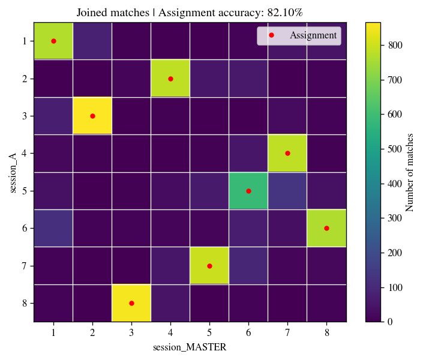

************
Idmatcher.ai
************

Idmatcher.ai is a tool included in idtracker.ai to match identities from two different tracking sessions under some constrains:

- The sessions must have the **same identification image size**. Identification networks cannot process images whose sizes are different from the ones used during training. Check :ref:`this section <identification_image_size>` to know how to set a fixed identification image size for all your tracking sessions.
- The sessions should come from the **same idtracker.ai version**. Different idtracker.ai versions can generate slightly different identification images making them impossible to match. You can still try to match them and interpret the results.

Usage
=====

To run idmatcher.ai, type the command above with a list of successfully tracked sessions:

.. code-block:: bash

    idmatcherai path/to/session_MASTER path/to/session_A path/to/session_B ...

Then, idmatcher.ai will match identities of every session (starting from the second session on the list) with the master session (the first on the list). In the example above, idmatcher.ai would match ``session_A`` with ``session_MASTER`` and ``session_B`` with ``session_MASTER``.

When matching two sessions, say matching ``A`` with ``MASTER``, all the individual images from ``A`` are identified using the identification network from ``MASTER``. This creates a **direct matching matrix** where every row contains the identity predictions (according to ``MASTER``) of the images belonging to the same identity of ``A``. This matrix is saved in a *.csv* file and plotted in a *.png* image.

Then, images from ``MASTER`` are identified with the identification network from ``A`` (the other way around) generating an **indirect matching matrix**. This matrix is also saved in *.csv* and *.png* files.

    *Joined matching matrix* example from idmatcher.ai

Finally, both direct and indirect matching matrices are joined into a single matrix (saved in a *.csv* and *.png* file as *Joined matrix*). Every row of the joined matrix is assigned with a different column by maximizing the number of matches using the `Hungarian algorithm <https://en.wikipedia.org/wiki/Hungarian_algorithm>`_. The assignment is saved in a *results.csv* file where every identity of ``A`` (first column) is matched with an identity of ``MASTER`` (second column). This assignment is also plotted in the joined matrix *.png* file as red dots. The final accuracy is computed as the ratio of matches being agree with the proposed assignment.

.. caution::
    When matching sessions with different number of animals, only the images from the session with the lower number of animals will be matched.
