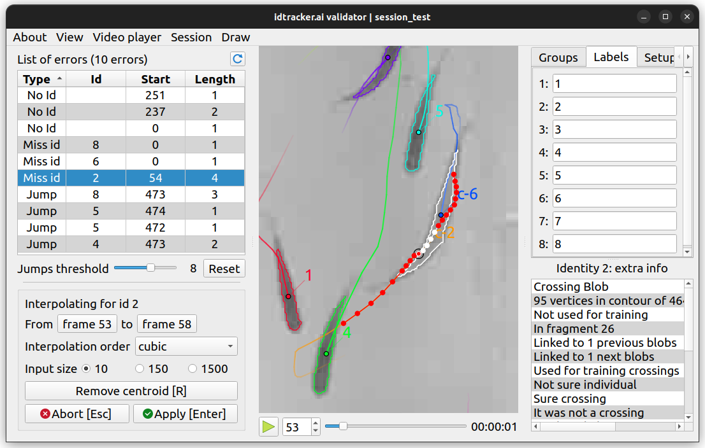

    Under construction...

*********
Validator
*********

.. role:: toml(code)
   :language: toml

.. admonition:: Warning
    :class: sidebar warning

    This tool may be overwhelming for beginner users, there's not need to use is to get decent trajectories.

Idtracker.ai's validator is a graphical application to check, modify and validate a successful tracking session. It loads the ``list_of_blobs`` and the ``video_object`` from the session folder so it do **NOT** set :toml:`data_policy = 'trajectories'` if you want to use this tool.

To start the app, run the next command:

.. code-block:: bash

    idtrackerai_validator path/to/session_folder

to open the desired session, or just

.. code-block:: bash

    idtrackerai_validator

to open a blank validator and manually load a session with :kbd:`Ctrl+O`.

.. figure:: ../_static/validator_dark.png
    :class: only-dark

    idtracker.ai's validator application

.. grid::
    :gutter: 0
    :class-container: sd-text-center
    :outline:
    :padding: 0

    .. grid-item::
        :padding: 2
        :columns: 12

        .. button-ref:: app_actions_link
            :color: primary
            :outline:

        Actions related to the application and its operation

    .. grid-item::
        :columns: 4

        .. grid::
            :margin: 0
            :gutter: 0
            :outline:

            .. grid-item::
                :padding: 2

                .. button-ref:: list_of_errors_link
                    :color: primary
                    :outline:
                
                An error analyzer and explorer

        .. grid::
            :padding: 0
            :gutter: 0

            .. grid-item::
                :padding: 2
                :columns: 12

                .. button-ref:: interpolator_link
                    :color: primary
                    :outline:
                
                The interpolation tool to close *NaN* gaps

    .. grid-item::
        :padding: 2
        :outline:
        :columns: 4

        .. button-ref:: video_player_link
            :color: primary
            :outline:

        The interactive video player displaying the current video frame with all extra information on top

    .. grid-item::
        :columns: 4

        .. grid::
            :margin: 0
            :gutter: 0
            :outline:

            .. grid-item::
                :padding: 2
                :columns: 12

                .. button-ref:: extra_tools_link
                    :color: primary
                    :outline:
                
                A collection of three minor impact tools

        .. grid::
            :gutter: 0

            .. grid-item::
                :padding: 2
                :columns: 12

                .. button-ref:: blob_extra_info_link
                    :color: primary
                    :outline:
                
                Displayer of selected blob's main attributes

.. _app_actions_link:

App actions
-----------

Here you'll find the application options. None has an effect on the data being validated and most of them have an associated shortcut.

- **About**: link to this webpage and update checker.
- **View**: access to quit the app, change the font size and toggle the dark theme.
- **Video Player**

  - **Enable Color**: toggles color in the video player.
  - **Limit framerate**: limits the frame rate to the original framerate of the input video (default to ``True`` because the there's minimum processing while playing the video and maximum framerate could be too much).
  - **Reduce memory usage**: A cache system is implemented in the video player to access the previously displayed frames faster. The size of this cache is limited to the last 128 frames. Enable this options to reduce this to the last 16 frames.

- **Session**: open a session by browsing the desired session folder and save the current session as well as generating the corresponding validated trajectory file.
- **Draw**: toggle different blob's attributes to draw in the video player. Regions of interest can also be drawn when present.

.. _list_of_errors_link:

List of errors
--------------

A list of all errors in the current session classified in four error types:

- ``No id`` A blob's centroid could not be identified or has a invalid identity.
- ``Miss id`` The animal with identity ``Id`` couldn't be located (*NaN* gap).
- ``Jump`` The speed of animal the animal with identity ``Id`` is suspiciously large.
- ``Dupl`` (Duplicated) There are more than one centroid identified as animal ``Id``.

``Jump`` errors are triggered when an animal moves faster than the mean value plus :math:`x` times the standard deviation (where both statistical measurements )

.. _interpolator_link:

Interpolator
------------

.. _video_player_link:

Video player
------------

.. _extra_tools_link:

Extra tools
-----------

.. _blob_extra_info_link:

Blob's extra info
-----------------

Validator shortcuts
===================

.. list-table:: 
    :widths: auto
    :header-rows: 1

    * - Key
      - Action
    * - :kbd:`Q`
      - Quit the app
    * - :kbd:`Ctrl+O`
      - Open session
    * - :kbd:`Ctrl+S`
      - Save trajectories
    * - :kbd:`Alt+L`
      - Toggle labels drawing
    * - :kbd:`Alt+C`
      - Toggle contours drawing
    * - :kbd:`Alt+P`
      - Toggle centroids drawing
    * - :kbd:`Alt+B`
      - Toggle bounding boxes drawing
    * - :kbd:`Alt+T`
      - Toggle trails drawing
    * - :kbd:`Alt+R`
      - Toggle ROIs drawing
    * - :kbd:`Space`
      - Play/pause video player
    * - :kbd:`1` - :kbd:`9`
      - Change the video playback speed
    * - :kbd:`Right` / :kbd:`D`
      - Move video playback forward
    * - :kbd:`Left` / :kbd:`A`
      - Move video playback backward
    * - :kbd:`U`
      - Update list of errors
    * - :kbd:`Enter`
      - Apply interpolation (when interpolating)
    * - :kbd:`Esc`
      - Abort interpolation (when interpolating)
    * - :kbd:`R`
      - Remove current centroid (when interpolating)
